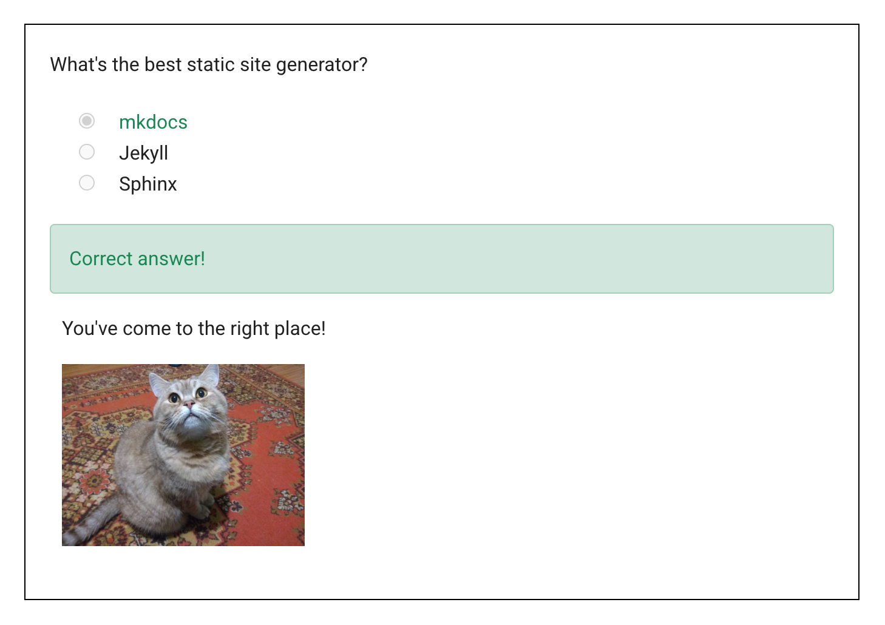

# MkDocs Quiz Plugin

[](https://badge.fury.io/py/mkdocs-quiz)
[](https://pypi.org/project/mkdocs-quiz/)
[](https://opensource.org/licenses/Apache-2.0)

A modern MkDocs plugin to create interactive quizzes directly in your markdown documentation. Perfect for educational content, tutorials, and documentation that requires user engagement.

**📚 Documentation and examples: [https://ewels.github.io/mkdocs-quiz/](https://ewels.github.io/mkdocs-quiz/)**

## Features

- ✨ **Simple markdown syntax** - Create quizzes using GitHub-flavored markdown checkboxes
- 🎯 **Single and multiple choice** - One correct answer = radio buttons, multiple = checkboxes
- ⚡ **Instant feedback** - Visual indicators show correct/incorrect answers
- 📊 **Progress tracking** - Automatic progress sidebar and results panel, with confetti :tada:

```markdown
<quiz>
What's the best static site generator?
- [x] mkdocs
- [ ] Jekyll
- [ ] Sphinx

You've come to the right place!


</quiz>
```

<picture>
  <source media="(prefers-color-scheme: dark)" srcset="docs/images/quiz_readme_dark.png">
  <source media="(prefers-color-scheme: light)" srcset="docs/images/quiz_readme.png">
  
</picture>

## Installation

Install the package with pip:

```bash
pip install mkdocs-quiz
```

## Quick Start

### 1. Enable the plugin

Add the plugin to your `mkdocs.yml`:

```yaml
plugins:
  - mkdocs-quiz
```

### 2. Create your first quiz

#### Single choice quiz

Create a quiz with radio buttons (only one correct answer):

```markdown
<quiz>
What is 2+2?
- [x] 4
- [ ] 3
- [ ] 5

Correct! Basic math is important.
</quiz>
```

#### Multiple choice quiz

Create a quiz with checkboxes (multiple correct answers):

```markdown
<quiz>
Which are even numbers?
- [x] 2
- [ ] 3
- [x] 4
- [ ] 5

Great! 2 and 4 are both even numbers.
</quiz>
```

> **Note:** Use `- [x]` for correct answers and `- [ ]` for incorrect answers. The plugin automatically uses radio buttons for single-choice and checkboxes for multiple-choice quizzes.

## Demo & Screenshots

Check out the [live demo](https://ewels.github.io/mkdocs-quiz/) to see the plugin in action.

### Single choice


### Multiple choice


## Contributing

Contributions are welcome! Please see [CONTRIBUTING.md](CONTRIBUTING.md) for guidelines.

## License

This project is licensed under the Apache License 2.0 - see the LICENSE file for details.

## Credits

- Original author: [Sebastian Jörz](https://github.com/skyface753)
- Co-maintained by: [Phil Ewels](https://github.com/ewels)

## Changelog

See [CHANGELOG.md](CHANGELOG.md) for version history and changes.
